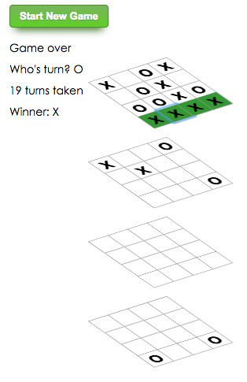

3D Tic-Tac-Toe (four in a row)
------------------------------

### Installation

$ npm install

### Running

$ npm start

### Screenshot

### References

This project was bootstrapped with [Create React App](https://github.com/facebookincubator/create-react-app).

This project was based on the tic-tac-toe [react tutorial](https://facebook.github.io/react/tutorial/tutorial.html).

### How to play

- Two players, X and O
- Players alternate taking turns on the same device
- Future considerations:
  - Add Redux
  - Update display
  - Add "undo" feature
  - Add server for remote games
  - Add rotation controls
